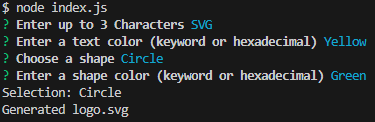

# LogoLord

The program allows you to generated SVG images using a command line prompt

SVG Example

Command Line Prompt

## Installation

Download via github by cloning the repository, npm install in the command line

## Usage

Type node index.js in the command line

Github Repository: 

https://github.com/SHoang6702/LogoLord

Youtube:
https://youtu.be/sXmu6-Dn2yk

## Credits
Collaborators:
Sebastian Hoang
## Features

## License
None